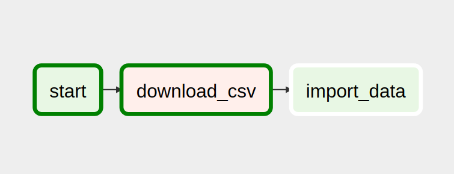

# Dominios gov.br

[](https://travis-ci.org/gilsondev/dag_dominios_govbr)
[](https://codeclimate.com/github/gilsondev/dag_dominios_govbr/maintainability)
[](https://pyup.io/repos/github/gilsondev/dag_dominios_govbr/)
[](https://pyup.io/repos/github/gilsondev/dag_dominios_govbr/)

Projeto criado para importar dados dos dominios gov.br autorizados pelo
Min. do Planejamento

*   Licença: GNU General Public License v3

## Fluxo da DAG



## Instalação

1.  Faça o checkout do projeto a instale as dependências

```shell
$ git clone https://github.com/gilsondev/dag_dominios_govbr
$ cd dag_dominios_govbr
$ python3 -m venv .venv
$ source .venv/bin/activate
$ pip install -r requirements_dev.txt
```

2.  Faça a configuração do Airflow localmente:

```shell
$ make setup_airflow
```

Isso irá executar o `initdb`, criar uma pasta `airflow` e apontá-lo via `AIRFLOW_HOME`. Após esse comando, ainda assim é recomendável registrar a variável de ambiente conforme [a documentação](https://airflow.apache.org/start.html)

3.  Instale o pacote no modo `develop` para refletir as mudanças no módulo:

```shell
$ make develop
```

Isso irá também criar um link simbólico do módulo aonde contém a DAG na pasta `dags` no ambiente do Airflow. Assim a cada mudança, ela será refletida.

## Testando o código

Foi configurado no `tox.ini` os procedimentos para execução dos testes automatizados dos módulos, como a execução da DAG via `airflow backfill`, para verificar a execução de todo o fluxo:

```
$ tox
```

## Créditos

Esse pacote foi criado com [Cookiecutter](https://github.com/audreyr/cookiecutter) e com o template de projetos [gilsondev/cookiecutter-airflow](https://github.com/gilsondev/cookiecutter-airflow)
